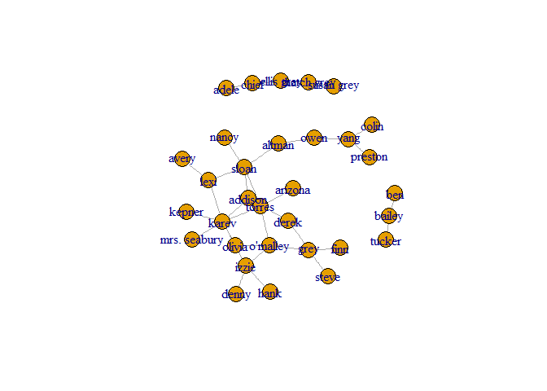
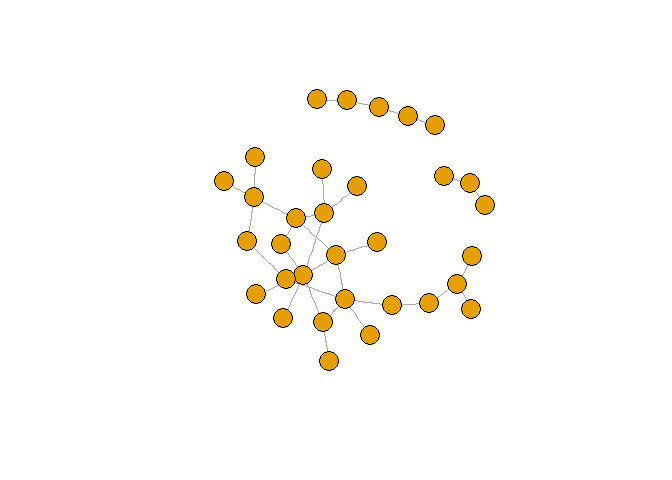
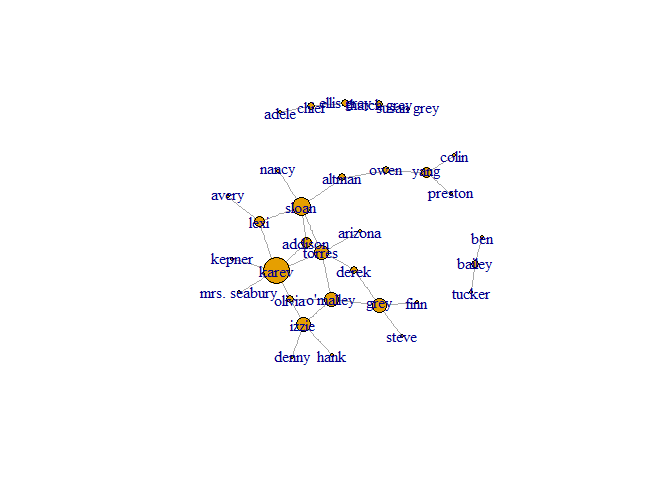
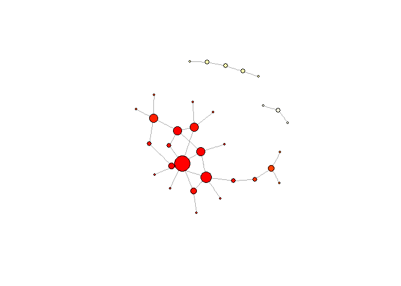
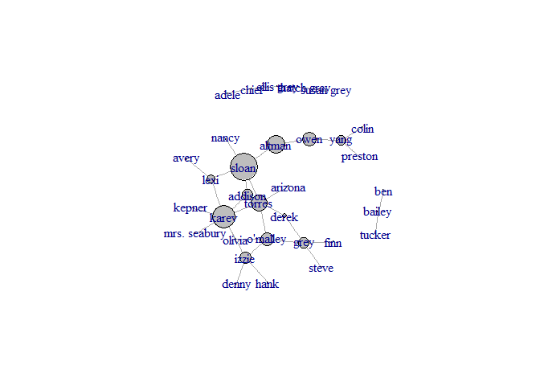

AnalyzeGraysAnatomyNetwork
================
GuyGo and Ofri Masad

Network Analysis:
=================

### Reading the data

The data is a csv files containing the graph edges of my twitter followers. And edge is represented by couple: {From, To}

``` r
head(ga.data)
```

    ##    from     to
    ## 1  lexi  sloan
    ## 2  lexi  karev
    ## 3  owen   yang
    ## 4  owen altman
    ## 5 sloan torres
    ## 6 sloan altman

### Data exploration:

#### Followers:

We've fetched information from CatcherGG\[Guy Gonen\] and his 134 followers. For each follower we fetched up to 200 possible followers and then dropped people which are not following CatcherGG In order to not exceed 200 nodes.

``` r
V(g)$name
```

    ##  [1] "lexi"         "owen"         "sloan"        "torres"      
    ##  [5] "derek"        "karev"        "o'malley"     "yang"        
    ##  [9] "grey"         "chief"        "ellis grey"   "susan grey"  
    ## [13] "bailey"       "izzie"        "altman"       "arizona"     
    ## [17] "colin"        "preston"      "kepner"       "addison"     
    ## [21] "nancy"        "olivia"       "mrs. seabury" "adele"       
    ## [25] "thatch grey"  "tucker"       "hank"         "denny"       
    ## [29] "finn"         "steve"        "ben"          "avery"

#### Number of Connections between followers and followers of followers:

``` r
summary(g)
```

    ## IGRAPH UN-- 32 34 -- 
    ## + attr: name (v/c)

### Data-visualization:

#### Basic representation:

``` r
g$layout <- layout.fruchterman.reingold(g)
plot(g)
```

<!-- --> \#\#\#\# Basic representation without names \[We'll continue without names from now on\]:

``` r
V(g)$label <- NA 
g$layout <- layout.fruchterman.reingold(g)
plot(g)
```

<!-- -->

#### Degree score:

``` r
degr.score <- degree(g)
degr.score
```

    ##         lexi         owen        sloan       torres        derek 
    ##            3            2            5            4            2 
    ##        karev     o'malley         yang         grey        chief 
    ##            7            4            3            4            2 
    ##   ellis grey   susan grey       bailey        izzie       altman 
    ##            2            1            2            4            2 
    ##      arizona        colin      preston       kepner      addison 
    ##            1            1            1            1            3 
    ##        nancy       olivia mrs. seabury        adele  thatch grey 
    ##            1            2            1            1            2 
    ##       tucker         hank        denny         finn        steve 
    ##            1            1            1            1            1 
    ##          ben        avery 
    ##            1            1

``` r
V(g)$size <- degree(g) * 3 # multiply by 2 for scale 
plot(g)
```

<!-- -->

#### Closeness centrality:

``` r
clo <- closeness(g) 
# rescale values to match the elements of a color vector 
clo.score <- round( (clo - min(clo)) * length(clo) / max(clo) ) + 1 
# create color vector, use rev to make red "hot" 
clo.colors <- rev(heat.colors(max(clo.score))) 
V(g)$color <- clo.colors[ clo.score ] 
plot(g)
```

<!-- -->

#### Betweeness centrality.

``` r
btw <- betweenness(g) 
btw.score <- round(btw) + 1 
btw.colors <- rev(heat.colors(max(btw.score))) 
V(g)$color <- btw.colors[ btw.score ] 
plot(g)
```

<!-- -->

### Insights:

1.  There are 7 disjoint cliques. When taking a closer look at the people in each cliques it was possible to easily tag them: University, Army, English twitter persons, ...
2.  It wasn't a suprise that CatcherGG would be in the middle since we know that everyone follows him.
3.  There is one clique which is made of people that almost has no followers, And they are connected with themselves and a few others. Some of them are bots and some of them are new people that are not active this days.
