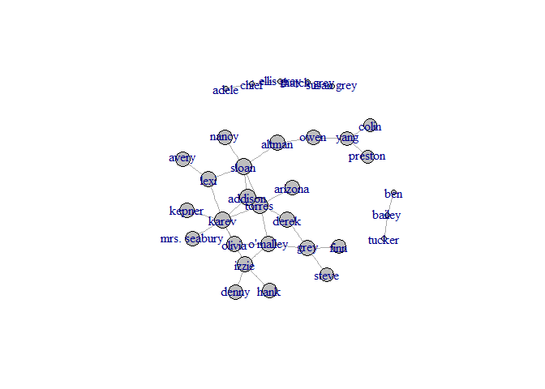

AnalyzeGraysAnatomyNetwork
================
GuyGo and Ofri Masad

Network Analysis:
=================

### Reading the data

The data is a csv files containing the graph edges of greys anatomy characters sexual relations. And edge is represented by couple: {From, To}

``` r
head(ga.data)
```

    ##    from     to
    ## 1  lexi  sloan
    ## 2  lexi  karev
    ## 3  owen   yang
    ## 4  owen altman
    ## 5 sloan torres
    ## 6 sloan altman

### Data exploration:

#### Relations:

let's look on all the characters we got.

``` r
V(g)$name
```

    ##  [1] "lexi"         "owen"         "sloan"        "torres"      
    ##  [5] "derek"        "karev"        "o'malley"     "yang"        
    ##  [9] "grey"         "chief"        "ellis grey"   "susan grey"  
    ## [13] "bailey"       "izzie"        "altman"       "arizona"     
    ## [17] "colin"        "preston"      "kepner"       "addison"     
    ## [21] "nancy"        "olivia"       "mrs. seabury" "adele"       
    ## [25] "thatch grey"  "tucker"       "hank"         "denny"       
    ## [29] "finn"         "steve"        "ben"          "avery"

#### Number of Connections between characters:

``` r
summary(g)
```

    ## IGRAPH UN-- 32 34 -- 
    ## + attr: name (v/c)

### Data-visualization:

#### Basic representation:

``` r
g$layout <- layout.fruchterman.reingold(g)
plot(g)
```

<!-- -->

#### Degree score:

``` r
degr.score <- degree(g)
degr.score
```

    ##         lexi         owen        sloan       torres        derek 
    ##            3            2            5            4            2 
    ##        karev     o'malley         yang         grey        chief 
    ##            7            4            3            4            2 
    ##   ellis grey   susan grey       bailey        izzie       altman 
    ##            2            1            2            4            2 
    ##      arizona        colin      preston       kepner      addison 
    ##            1            1            1            1            3 
    ##        nancy       olivia mrs. seabury        adele  thatch grey 
    ##            1            2            1            1            2 
    ##       tucker         hank        denny         finn        steve 
    ##            1            1            1            1            1 
    ##          ben        avery 
    ##            1            1

``` r
V(g)$size <- degree(g) * 3 
plot(g)
```

<!-- -->

#### Closeness centrality:

``` r
clo <- closeness(g) 
V(g)$color <- "gray"
V(g)$size <- clo*5000
V(g)$label <- V(g)$name
plot(g)
```

<!-- -->

``` r
clo
```

    ##         lexi         owen        sloan       torres        derek 
    ##  0.003115265  0.002898551  0.003174603  0.003194888  0.003039514 
    ##        karev     o'malley         yang         grey        chief 
    ##  0.003174603  0.003134796  0.002754821  0.003003003  0.001148106 
    ##   ellis grey   susan grey       bailey        izzie       altman 
    ##  0.001149425  0.001144165  0.001075269  0.003076923  0.003039514 
    ##      arizona        colin      preston       kepner      addison 
    ##  0.002985075  0.002597403  0.002597403  0.002967359  0.003174603 
    ##        nancy       olivia mrs. seabury        adele  thatch grey 
    ##  0.002967359  0.003039514  0.002967359  0.001144165  0.001148106 
    ##       tucker         hank        denny         finn        steve 
    ##  0.001074114  0.002881844  0.002881844  0.002816901  0.002816901 
    ##          ben        avery 
    ##  0.001074114  0.002915452

``` r
which.max(clo)
```

    ## torres 
    ##      4

torres is the most central by Closeness

#### Betweeness centrality.

``` r
btw <- betweenness(g) 
V(g)$color <- "gray"
V(g)$size <- btw/4
V(g)$label <- V(g)$name
plot(g)
```

<!-- -->

``` r
btw
```

    ##         lexi         owen        sloan       torres        derek 
    ##     36.00000     60.00000    115.36667     67.15000     17.95000 
    ##        karev     o'malley         yang         grey        chief 
    ##     95.26667     54.41667     43.00000     46.86667      3.00000 
    ##   ellis grey   susan grey       bailey        izzie       altman 
    ##      4.00000      0.00000      1.00000     47.95000     76.00000 
    ##      arizona        colin      preston       kepner      addison 
    ##      0.00000      0.00000      0.00000      0.00000     44.08333 
    ##        nancy       olivia mrs. seabury        adele  thatch grey 
    ##      0.00000      4.95000      0.00000      0.00000      3.00000 
    ##       tucker         hank        denny         finn        steve 
    ##      0.00000      0.00000      0.00000      0.00000      0.00000 
    ##          ben        avery 
    ##      0.00000      0.00000

``` r
which.max(btw)
```

    ## sloan 
    ##     3

sloan is the most central by Betweeness

#### Eigenvector centrality.

``` r
eig <- centr_eigen(g)
V(g)$color <- "gray"
V(g)$size <- eig$vector*15
V(g)$label <- V(g)$name
plot(g)
```

<!-- -->

``` r
eig$vector
```

    ##  [1] 5.255806e-01 6.780381e-02 6.418121e-01 7.178773e-01 2.500302e-01
    ##  [6] 1.000000e+00 6.006975e-01 2.394956e-02 3.004927e-01 3.543338e-17
    ## [11] 8.040237e-17 1.828613e-17 1.752547e-17 5.653959e-01 2.077024e-01
    ## [16] 2.101205e-01 7.009961e-03 7.009961e-03 2.926969e-01 5.537364e-01
    ## [21] 1.878564e-01 4.685192e-01 2.926969e-01 2.705687e-17 5.755060e-17
    ## [26] 1.831625e-17 1.654896e-01 1.654896e-01 8.795329e-02 8.795329e-02
    ## [31] 3.027240e-17 1.538358e-01

``` r
V(g)[which.max(V(g)$size)]
```

    ## + 1/32 vertex, named:
    ## [1] karev

karev is the most central by Eigenvector

#### Community strucure via short random walks

``` r
fc <- walktrap.community(g)
memb <- membership(fc)
plot(g, vertex.size=5, vertex.label=V(g)$name,vertex.color=memb+1, asp=FALSE)
```

<!-- -->

``` r
#number of communities and they size
table(memb)
```

    ## memb
    ##  1  2  3  4  5  6  7 
    ##  5 13  3  3  2  3  3

``` r
#the modularity
modularity(fc)
```

    ## [1] 0.5147059

#### Girvan-Newman community detection algorithm

``` r
gnc <- edge.betweenness.community(g, directed=FALSE)
memb2 <- membership(gnc)
plot(g, vertex.size=5, vertex.label=V(g)$name,vertex.color=memb2+1, asp=FALSE)
```

<!-- -->

``` r
#number of communities and they size
table(memb2)
```

    ## memb2
    ## 1 2 3 4 5 6 7 
    ## 8 5 4 4 5 3 3

``` r
#the modularity
modularity(gnc)
```

    ## [1] 0.5774221

### Insights:

1.  two hot guys leads in the number of sexual relations with other characters
2.  torres is bi-sexual
